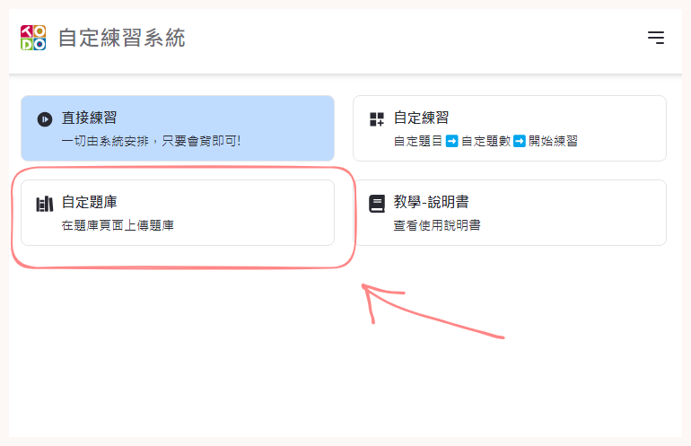
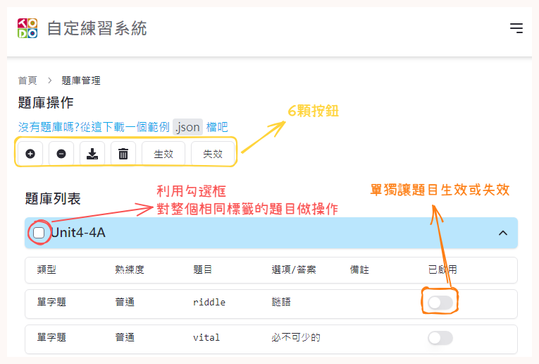
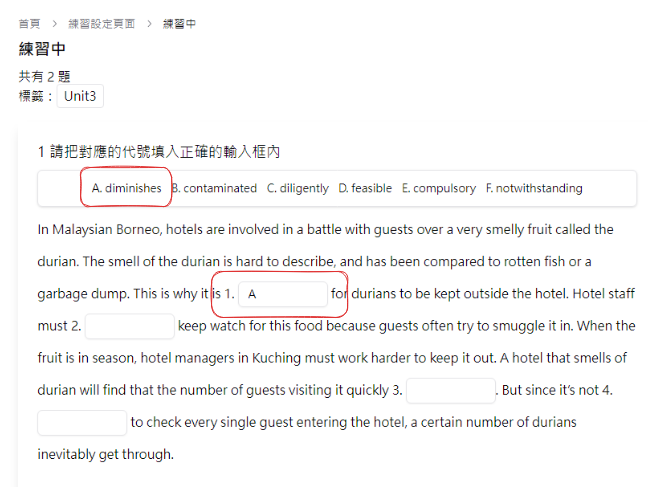
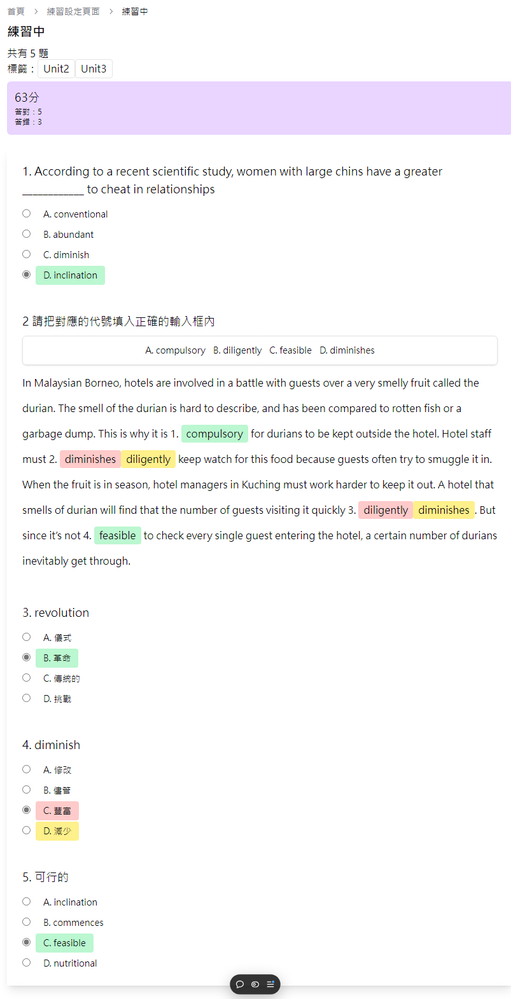

# 自定題目練習系統

## How to use ?

### 匯入題庫

點擊圖中題庫按鈕

點擊"新增 題目/標籤" 上傳`.json`檔(詳細格式可以查看[question.json](./src/assets/questions.json))

### 練習設定

上傳完成後可以回到首頁到點擊【開始練習】
可以設定標籤來排除不想練習的題目(預設是全部)

### 練習中

#### 填空題

如果預到填空題請填入**代號**

### 練習結束

做答完後按下送出按鈕，會出現得分數和答對與答錯的題數

- 選項顯示綠色代表答對
- 選項顯示黃色代表應該要選擇的答案
- 選項顯示紅色代表使用者選擇的錯誤答案

## Feature
- 題目
  - [x] 上傳題目
  - [x] 練習題目
  - [x] 題型
    - [x] 選擇題
    - [x] 填空題
    - [x] 配對題
    - [x] 單字題
    - [ ] 複選題
  - [x] 匯出題目
  - [ ] 自己新增題目
- 練習
  - [x] 可以多選標籤
  - [x] 做答時間
  - [ ] 讓題目有**啟用/關閉**的功能(enabled)
  - [ ] 作答中reload不會失去作答狀態和資料
  - [x] 單題式
  - 熟練度系統
    - [x] 做 對一次加一分 錯一次扣一分 最低-3分
    - [x] 如果due是null會有教學(直接增加題目)
    - [x] 新增 系統判斷 功能 (讓系統判斷目前該練習哪些題目)
- 其它
  - [x] 黑夜模式
  - [ ] 歷史記錄

## Libary

- React
- React-dom
- Shadcn/ui
- Tailwindcss
