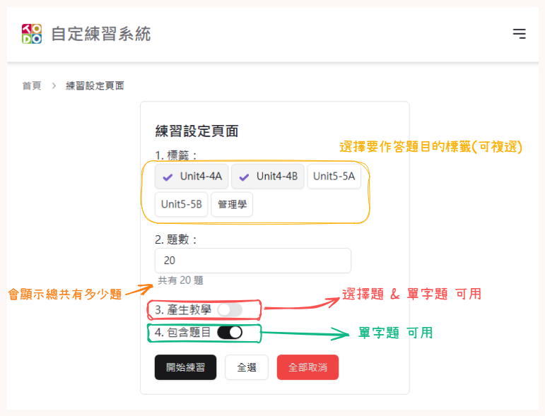

# 自定題目練習系統

## How to use ?

### 查看現在擁有的題庫

點擊圖中**自定題庫**按鈕

題庫列表可能跟你現在看到的不一樣(?)

畫面上有6顆按鈕 功能分別是
1. 新增題目(目前只支援透過上傳`.json`檔來新增 詳細格式可以查看[example.json](./src/assets/example.json))
2. 刪除勾選的題目(只有勾選時才會顯示)
3. 下載所有題庫(儲存進度)
4. 清空所有題庫
5. 生效勾選的題目(在做答的時候就會出現)(只有勾選時才會顯示)
6. 失效勾選的題目(不會出現在做答題目裡)(只有勾選時才會顯示)

### 直接練習 模式

#### 介紹

在首頁可以看到**直接練習**的按鈕，按下之後會有5題

作答方式：一題一題做答，按下會直接顯示對或錯

如果在作答中重新刷新頁面會出現NaN 那就可以回首頁 再重新作答

#### 下次做答時間

| 次數        | 時間        |
| ----------- | ----------- |
| 連續答錯2次 | 1分鐘       |
| 連續答錯1次 | 2分鐘       |
| 連續答對1次 | 6 小時      |
| 連續答對2次 | 12 小時     |
| 連續答對3次 | 16 小時     |
| 連續答對4次 | 1 天        |
| 連續答對5次 | 1 天 6 小時 |
| 連續答對6次 | 1 天半      |
| 連續答對7次 | 2 天        |
| 連續答對8次 | 4 天        |

#### 單字題

- 有教學
- 中文和英文都有
- 打亂順序

#### 選擇題

- 有教學
- 打亂順序

### 練習設定

上傳完成後可以回到首頁到點擊【開始練習】
可以設定標籤來排除不想練習的題目(預設是全部)

### 練習中

#### 填空題

如果預到填空題請填入**代號**

### 自定練習 模式

#### 介紹

如果在作答中重新刷新頁面會出現NaN 那就可以回首頁 再重新作答

### 練習結束

做答完後按下送出按鈕，會出現得分數和答對與答錯的題數

- 選項顯示綠色代表**答對**
- 選項顯示黃色代表使用者選擇的應該選擇的**正確答案**
- 選項顯示紅色代表使用者選擇的**錯誤答案**

## Feature
- 題目
  - [x] 上傳題目
  - [x] 練習題目
  - [x] 題型
    - [x] 選擇題
    - [x] 填空題
    - [x] 配對題
    - [x] 單字題
    - [ ] 複選題
  - [x] 匯出題目
  - [x] tag字體放大、變粗、變手風琴
  - [ ] 自己新增題目
- 練習
  - [x] 可以多選標籤
  - [x] 做答時間
  - [x] 讓題目有**啟用/關閉**的功能(enabled)
  - [x] 單題式
  - [x] 作答完顯示哪題對哪題錯(自定練習)
  - [ ] 作答中reload不會失去作答狀態和資料
  - 熟練度系統
    - [x] 做 對一次加一分 錯一次扣一分 最低-3分
    - [x] 如果due是null會有教學
      - 直接增加題目
    - [x] 新增 系統判斷 功能 (讓系統判斷目前該練習哪些題目)
    - [x] 做題答對時有scale動畫
- 其它
  - [x] 黑夜模式
  - [ ] 歷史記錄

## **Libary**

- React
- React-dom
- Shadcn/ui
- Tailwindcss
