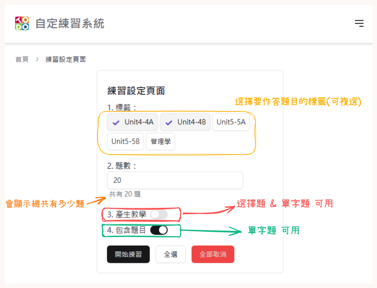

# How to use ?

## 查看現在擁有的題庫

點擊圖中**自定題庫**按鈕

題庫列表可能跟你現在看到的不一樣(?)

畫面上有6顆按鈕 功能分別是
1. 新增題目(目前只支援透過上傳`.json`檔來新增 詳細格式可以查看[example.json](./src/assets/example.json))
2. 刪除勾選的題目(只有勾選時才會顯示)
3. 下載所有題庫(儲存進度)
4. 清空所有題庫
5. 生效勾選的題目(在做答的時候就會出現)(只有勾選時才會顯示)
6. 失效勾選的題目(不會出現在做答題目裡)(只有勾選時才會顯示)

## 直接練習 模式

### 介紹

在首頁可以看到**直接練習**的按鈕，按下之後會有5題

作答方式：一題一題做答，按下會直接顯示對或錯

如果在作答中重新刷新頁面會出現NaN 那就可以回首頁 再重新作答

### 下次做答時間

| 次數        | 時間        |
| ----------- | ----------- |
| 連續答錯2次 | 1分鐘       |
| 答錯1次     | 2分鐘       |
| 答對1次     | 3 小時      |
| 連續答對2次 | 6 小時      |
| 連續答對3次 | 12 小時     |
| 連續答對4次 | 16 小時     |
| 連續答對5次 | 1 天        |
| 連續答對6次 | 1 天 6 小時 |
| 連續答對7次 | 1 天半      |
| 連續答對8次 | 2 天        |
| 連續答對9次 | 4 天        |

### 單字題

- 有教學
- 中文和英文都有
- 打亂順序

### 單選題

- 有教學
- 打亂順序

### 多選題

- 有教學
- 打亂順序

## 練習設定

上傳完成後可以回到首頁到點擊【開始練習】
可以設定標籤來排除不想練習的題目(預設是全部)

## 練習中

### 填空題

如果預到填空題請填入**代號**

## 自定練習 模式

### 介紹

如果在作答中重新刷新頁面會出現NaN 那就可以回首頁 再重新作答

## 練習結束

做答完後按下送出按鈕，會出現得分數和答對與答錯的題數

- 選項顯示綠色代表**答對**
- 選項顯示黃色代表使用者選擇的應該選擇的**正確答案**
- 選項顯示紅色代表使用者選擇的**錯誤答案**

